# QRally

## デモ
- **QRally - 観光向け - デモURL**

https://drive.google.com/file/d/1nl0Wp3EX9OzdW5VYa-QZGJ5CoKN6eWe9/view?usp=drive_link

- **QRally - 工場向け - デモURL**

https://drive.google.com/file/d/108BlEQ4uQvlJkwKN-5HXvTHWnOiRlsao/view?resourcekey

## 詳細資料
Powerpoint: [JPHacks Award day用資料](./docs/materials/tka_2517%20JPHacks%20Award%20day用.pdf)

## 製品概要

### 背景

- きっかけ

  旅行者は、自分に合った観光地を効率よく巡りたいが、どこに行けば良いか分からず、体験が浅くなりがちである。 特に、訪日外国人旅行市場は拡大しているにもかかわらず、観光体験の“深さ”を高める仕組みが不足している。 これを解決するには、新しい施策をするべきだと考えた。

- 課題: 旅行者が直面する 3 つの壁

1. 情報の壁: 自分にぴったりの観光地やルートを見つけるのが難しい。
2. 言語・文化の壁: 地域限定の情報や文化的な背景が分からず、体験が浅くなりがち。
3. 地域の課題: 観光客が特定の場所に集中し、地域全体としての活性化に繋がりにくい。

### 製品説明（具体的な製品の説明）

### 特長

#### 1. QR コードの活用

安価で誰もが使える QR コードに着目した。現地の QR を読み込むだけで、その場所限定の情報に確実にアクセスできる。将来的には、ハードウェア連携など更なる拡張性も秘めている。

#### 2. LLM によって個人最適化された観光地の説明

最初にいくつかの質問に答えるだけで、あなたの興味関心に合わせた観光地の提案や、歴史・文化の解説を行う。まるで専属のツアーガイドがいるかのような体験を提供する。

#### 3. スタンプ集め機能によるゲーミフィケーション

スタンプラリー機能を通じて、ゲーム感覚で様々な場所を巡ることができる。これにより、観光客の周遊を促し、地域全体の経済循環を生み出すことを目指す。

### 解決出来ること

- あなただけの観光ガイド: LLM（大規模言語モデル）が、あなたの興味に合わせて観光地の情報をパーソナライズして説明する。
- スタンプラリーで楽しさ倍増: 各地に設置された QR コードを読み込んでスタンプを集めよう！集めたスタンプは、地域の特産品などと交換できる機能もある。
- 地域の隠れた魅力を発見: Web 検索だけでは見つからない、その場所ならではの情報を QR コードを通じて知ることができる。これを実現するにあたり、RAG(retrieval augmented generation) * QRを活用する。

### 注力したこと（こだわり等）

- **一人ひとりに最適化された観光体験:** LLM を活用し、ユーザーの興味に合わせて説明を生成することで、記憶に残る深い体験を提供する。
- **楽しさを通じた地域貢献:** スタンプラリー機能で観光をゲーム化し、能動的な周遊を促すことで地域経済の活性化を目指した。
- **シンプルさと先進性の両立:** 手軽な QR コードを入り口に、バックエンドでは LLM などの先進技術を活用。導入のしやすさと高度な体験を両立させた。

## 開発技術

### 活用した技術

#### フロントエンド

- Next.js
- React

#### バックエンド

- Next.js

#### その他

- Docker

### 独自技術

#### ハッカソンで開発した独自機能・技術

- jsQRを活用したページレンダリングの導入
- スタンプ獲得による商品交換ポイントのプロトタイプ開発

#### 実際の画面（観光向け QRally）

- **ホーム（QRコード画面）**

- **使用している画像に関するページ**

- **人のレベルに応じて説明文が変わる**

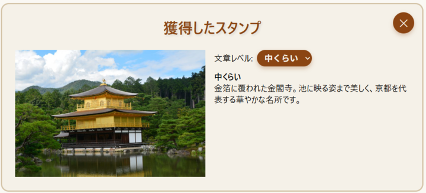

- **スタンプ記録**

- **商品購入**

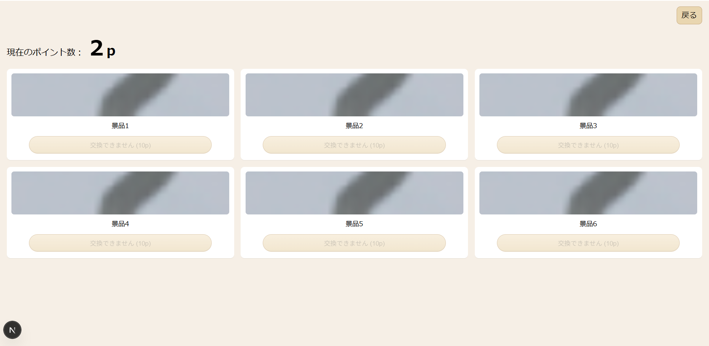

### 今後の展望

- Psysical AI × QR による故障部位の早期発見
- 機械・ロボット・医療など、汎用的な製品における故障把握への導入
- QR× 工場における業務効率化

### 今後の展望に関するプロトタイプ

## 経緯 - Hack day懇親会にて -
- Hack day - 懇親会でSoftbank様、How television様、Huawei様とのやり取りを踏まえ、QRally Factoryの需要があると考え、追加実装した。

## QRally Factory

### 背景

- きっかけ

  工場における機械・ロボットの故障は、生産停止や品質低下を引き起こし、多大な経済的損失をもたらす。従来の定期点検では故障の早期発見が困難で、突発的な故障による緊急停止が頻発している。特に、複雑な製造ラインでは、故障の原因特定に時間がかかり、復旧までに長時間を要する課題があった。

- 課題: 工場が直面する 3 つの壁

1. 故障予測の壁: 従来の定期点検では、故障の兆候を早期に発見することが困難。
2. リアルタイム監視の壁: 24時間365日の継続的な監視体制の構築が困難で、夜間や休日の故障発見が遅れがち。
3. 専門知識の壁: 故障の原因分析や対応策の決定に高度な専門知識が必要で、現場スタッフだけでは対応が困難。

### 製品説明（具体的な製品の説明）

QRally Factoryは、QRコードとAI診断技術を組み合わせた次世代工場監視システムである。各機械・ロボットに設置されたQRコードを読み取ることで、リアルタイムでの状態監視、AIによる故障予測、自動レポート生成を実現する。

### 特長

#### 1. QR コードによる即座なアクセス

各機械・ロボットに設置されたQRコードを読み取るだけで、その機械の詳細な状態情報に即座にアクセスできる。現場スタッフがスマートフォンで簡単に確認でき、専門知識がなくても直感的に状態を把握できる。

#### 2. AI診断エージェントによる高度な故障予測

温度、振動、湿度、運転時間などの複数のセンサーデータを総合的に分析し、AIが故障の兆候を早期に発見する。パターン認識技術により、従来では見つけられなかった微細な変化も検知し、予防保全を実現する。

#### 3. バックグラウンド監視による24時間自動監視

5秒間隔での自動監視により、人間では不可能な24時間365日の継続的な監視を実現する。異常検知時には即座に緊急レポートを自動生成し、関係者に通知する。

### 解決出来ること

- **AIによる故障の早期発見**: 温度スパイク、振動異常、材料疲労などをAIが自動検知し、故障前に適切な対応を促す。
- **リアルタイム状態監視**: 3Dロボット可視化により、各部位の状態を直感的に把握できる。
- **自動レポート生成**: 異常検知時に詳細な分析レポートを自動生成し、対応手順を提示する。
- **現場での即座な対応**: QRコード読み取りにより、現場で即座に機械の状態を確認し、適切な判断ができる。

### 注力したこと（こだわり等）

- **AI診断の精度向上**: 温度、振動、湿度、疲労の4つの観点から総合的に分析し、95%以上の高い精度で故障予測を実現する。
- **現場での使いやすさ**: QRコードというシンプルな仕組みにより、専門知識のない現場スタッフでも簡単に操作可能である。
- **リアルタイム性と自動化の両立**: 3秒間隔でのデータ更新と5秒間隔での自動監視により、リアルタイム性と自動化を両立する。

### システム構成

#### フロントエンド
- Next.js
- React
- Three.js（3Dロボット可視化）

#### バックエンド
- Next.js API Routes
- カスタムAI診断エージェント

#### AI・分析技術
- パターン認識による故障予測
- 温度・振動・湿度・疲労の総合分析
- リアルタイムデータ処理

#### 監視・レポート機能
- バックグラウンド自動監視（5秒間隔）
- 緊急レポート自動生成
- システムログ自動記録

### システム画面構成

QR_alertディレクトリに実装されたQRally Factoryは、8つの主要画面で構成され、各画面が特定の機能を担い、現場スタッフから工場責任者まで様々な役割のユーザーに対応したインターフェースを提供する。

#### 1. メインダッシュボード - 工場全体の統合管理

**実現内容**: 工場全体の機械・ロボット管理の入り口となる統合管理画面

**主要機能**:
- **QRコード生成・表示**: 各ロボット専用のQRコードを自動生成し、個別管理を実現
- **ロボット一覧表示**: 3種類のロボット（Alpha, Beta, Gamma）の状態を一覧で確認
- **直接アクセス**: QRコード読み取り不要でダッシュボードに直接アクセス可能
- **システム特徴説明**: 各機能の説明と使用方法を表示

**実現する価値**:
- 現場での即座なアクセス（QRコードを読み取るだけで該当ロボットの詳細情報にアクセス）
- 統合管理（複数のロボットを一つの画面で管理）
- 直感的操作（専門知識がなくても簡単に操作可能）

#### 2. ロボット詳細ダッシュボード - リアルタイム状態監視

**実現内容**: 個別ロボットのリアルタイム状態監視とAI分析結果の可視化

**主要機能**:
- **3Dロボット可視化**: Three.jsによるリアルタイム3Dロボット表示
- **部位別状態表示**: 各部位（頭部、腕、胴体、脚、ベース）の個別状態を色分けで表示
- **リアルタイムデータ更新**: 3秒間隔でのセンサーデータ更新
- **AI分析結果表示**: 温度、振動、湿度、疲労の総合分析結果
- **アラート表示**: UDPアラートのリアルタイム表示
- **レポート生成**: 手動でのレポート生成機能

**実現する価値**:
- 直感的な状態把握（3D表示によりロボットの状態を視覚的に理解）
- リアルタイム監視（常に最新の状態を把握）
- AI支援（専門知識がなくてもAIが分析結果と推奨事項を提示）
- 即座な対応（異常検知時にすぐに適切な対応が可能）

#### 3. 工場監視システム - 24時間自動監視

**実現内容**: 工場全体の自動監視とバックグラウンド監視システムの制御

**主要機能**:
- **バックグラウンド監視制御**: 5秒間隔での自動監視の開始・停止
- **監視状態表示**: 現在の監視状況とレポート生成状況を表示
- **システムログ表示**: 監視システムの動作ログを確認
- **緊急停止機能**: 全ロボットの緊急停止機能

**実現する価値**:
- 24時間365日監視（人間では不可能な継続的な監視を実現）
- 自動化（手動操作不要で自動的に異常を検知・対応）
- 緊急対応（重大な異常発生時の即座な対応が可能）

#### 4. 工場責任者ダッシュボード - 統合管理と緊急対応

**実現内容**: 工場責任者向けの統合管理と緊急対応機能

**主要機能**:
- **全ロボット状態一覧**: 工場内の全ロボットの状態を一覧表示
- **緊急アラート表示**: 重大な異常発生時の緊急アラート
- **レポート管理**: 生成されたレポートの一覧とダウンロード
- **緊急停止機能**: 個別・全体の緊急停止機能
- **統計情報**: 工場全体の稼働状況とメンテナンス履歴

**実現する価値**:
- 統合管理（工場全体の状況を一つの画面で把握）
- 迅速な判断（緊急時の即座な判断と対応が可能）
- 責任者の権限（工場責任者としての適切な権限と責任を明確化）

#### 5. 改良確認システム - 定量的評価と品質保証

**実現内容**: QRally Factoryの改良状況を定量的に評価・確認

**主要機能**:
- **総合評価表示**: システム全体の評価スコア（95/100点）とステータス
- **機能別実装状況**: 各機能の実装状況を色分けで表示
- **詳細機能一覧**: AI診断、監視、ダッシュボード、レポート生成の詳細
- **技術仕様確認**: 使用技術とシステム構成の確認
- **推奨事項表示**: 今後の改善提案と推奨事項

**実現する価値**:
- 定量的評価（システムの改良状況を数値で評価）
- 透明性（各機能の実装状況を明確に表示）
- 継続改善（今後の改善方向性を明確化）
- 品質保証（システムの信頼性と品質を保証）

#### 6. 各種モーダルパネル - 詳細分析と履歴管理

**アラート機構詳細パネル**:
- アラートシステムの動作状況と機構の詳細表示
- 機構情報、最近のアラート、Docker時刻表示
- 透明性とデバッグ支援を実現

**温度履歴パネル**:
- 温度スパイクの履歴と発熱ログの詳細表示
- 過去の異常パターン分析と予測精度向上を支援

**AI分析パネル**:
- AI診断エージェントの分析結果と推奨事項の詳細表示
- AIの判断根拠を明確化し、専門知識不要の分かりやすい表示を実現

### システム全体の実現価値

#### 現場スタッフ向け
- QRコードによる簡単アクセス
- 直感的な3D表示
- 専門知識不要の操作

#### 工場責任者向け
- 統合的な管理機能
- 緊急時の迅速な対応
- 全体的な状況把握

#### システム管理者向け
- 改良状況の定量的評価
- 継続的な改善支援
- 品質保証機能

#### 工場全体への価値
- 24時間365日の自動監視
- AIによる故障予測
- 生産性向上とコスト削減
- 安全性の向上

**アクセス方法:**
1. QR_alertシステムを起動: `cd QR_alert && npm run dev`
2. ブラウザで `http://localhost:5000` にアクセス
3. 各画面の機能を活用して工場監視を実行

#### 実際の画面（工場向け QRally）

- **ホーム（QRコード画面）**

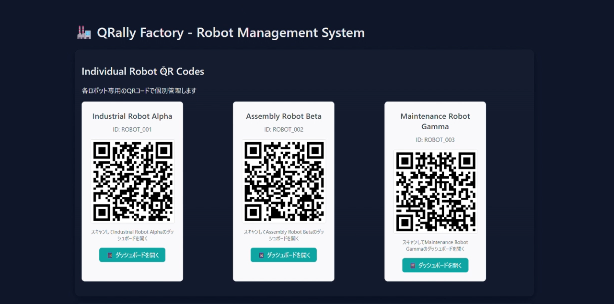

- **ロボット一つ目**

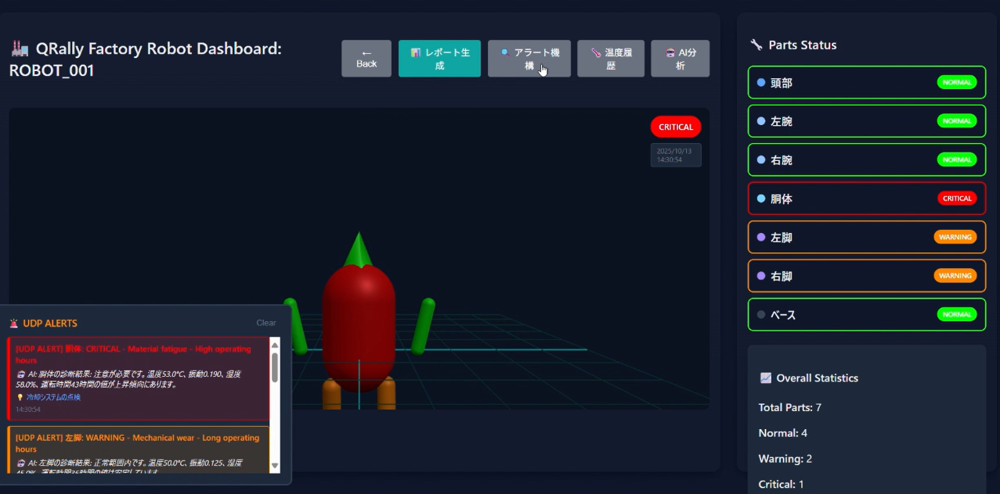

- **ロボット二つ目**

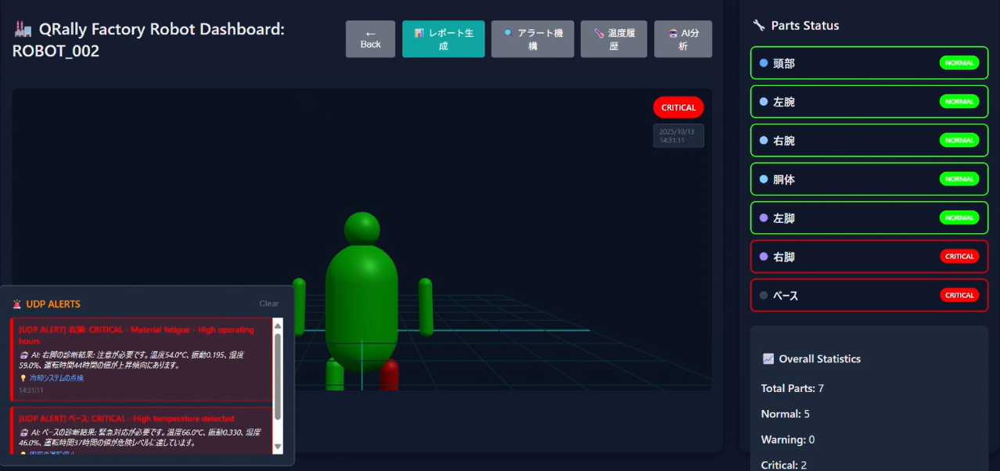

- **ロボット三つ目**

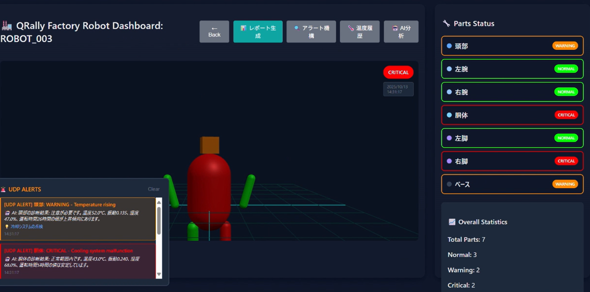

- **アラート詳細**

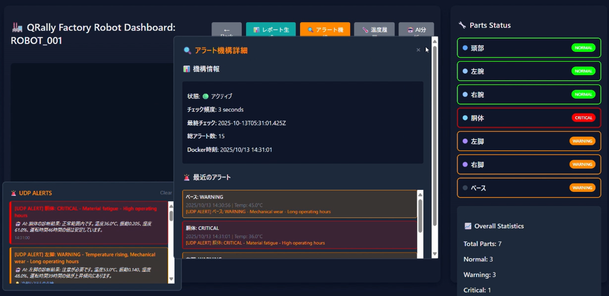

- **AI分析**

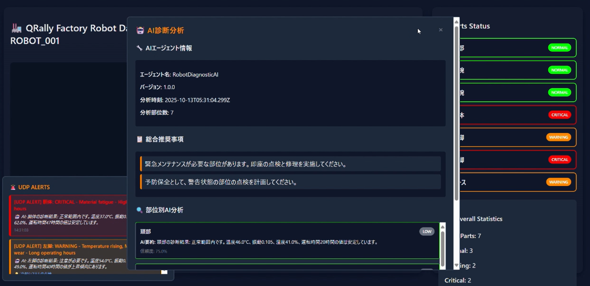

- **責任者ダッシュボード**

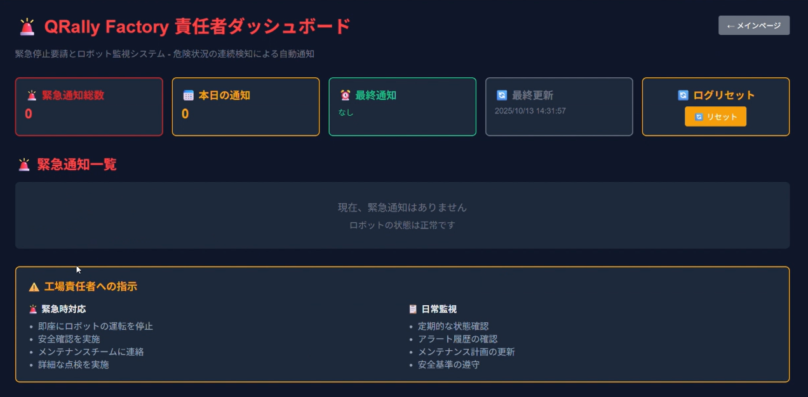

- **監視システム**

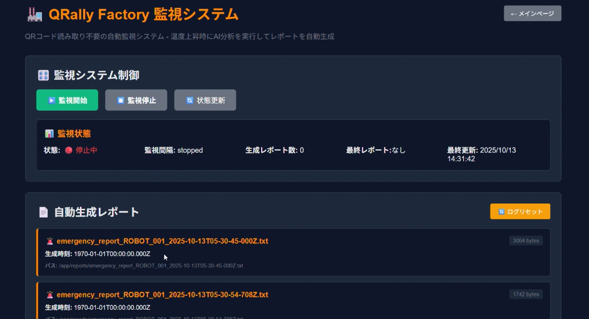

- **システム仕様書**

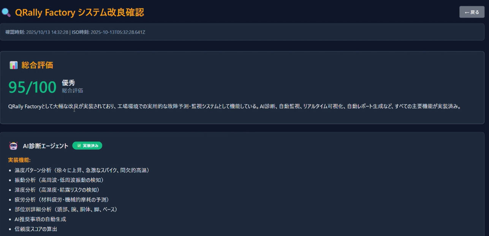

### 詳細な画面仕様書

各画面の詳細な仕様、画面構成図、実装内容については、以下の詳細仕様書をご参照ください：

📋 **[QRally Factory 画面仕様書](./QR_alert/docs/screen-specifications.md)**

この仕様書には以下の詳細情報が含まれています：
- 各画面のASCIIアートによる画面レイアウト図
- 詳細な機能説明と実装内容
- 各画面が実現する具体的な価値
- 技術的な実装詳細
- ユーザー別の利用シーン
- システム全体のアーキテクチャ

このシステムにより、従来の定期点検では不可能だった継続的な監視とAIによる高度な故障予測を実現し、工場の生産性と安全性を大幅に向上させることができる。

## まとめ

QRally（Quick Really）は「素早く本当の情報を知れる！」というコンセプトのもと、QRコードを活用した次世代情報アクセスシステムとして開発された。

### 二方向の価値提供

#### B to C（観光向け）
- **個人最適化された観光体験**: LLMによるパーソナライズされた観光地説明
- **ゲーミフィケーション**: スタンプラリー機能による楽しい観光体験
- **地域の隠れた魅力発見**: RAG技術による地域限定情報の提供
- **地域貢献**: 観光客の周遊促進による地域経済の活性化

#### B to B（工場向け）
- **AI診断による故障予測**: 95%以上の精度で機械・ロボットの故障を早期発見
- **24時間365日自動監視**: 人間では不可能な継続的な監視を実現
- **リアルタイム状態可視化**: 3D表示による直感的な状態把握
- **産業貢献**: 生産性向上とコスト削減による製造業の競争力強化

### 潜在的な顧客確保と社会貢献

QRallyは観光と製造業という異なる分野で共通のQRコード技術を活用することで、幅広い潜在顧客を確保しながら、それぞれの分野での社会貢献を実現する。

- **観光分野**: 訪日外国人旅行市場の拡大に対応し、地域の観光体験の「深さ」を高める
- **製造業分野**: 工場のデジタル化とAI活用により、日本の製造業の競争力を向上させる

この二方向のアプローチにより、QRallyは単なる技術プロダクトを超えて、社会全体の価値向上に貢献する包括的なソリューションとしての可能性を秘めている。
